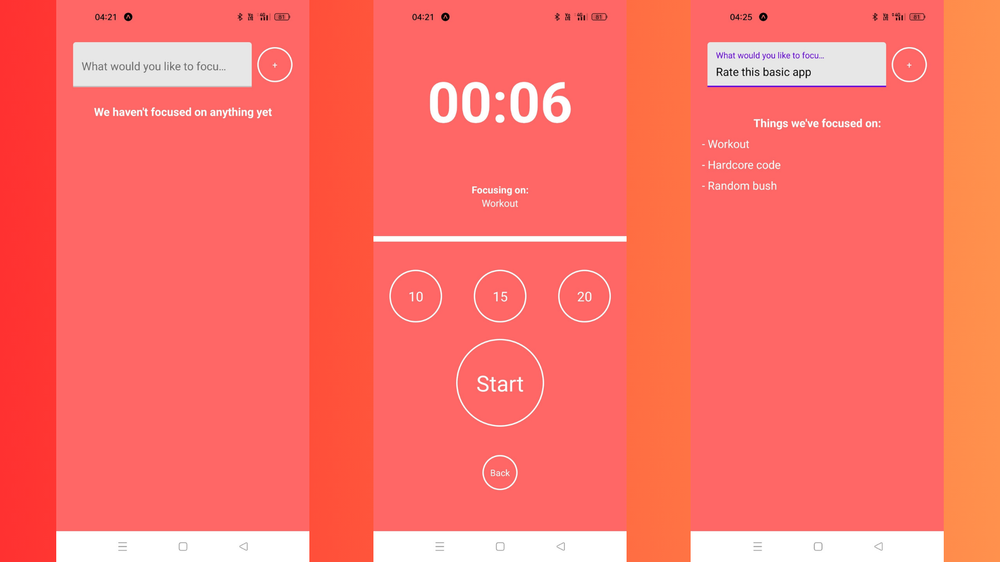

# About this project

This is a react native project built using expo CLI and it uses the best practises and industry standards. It is used for focusing on the things that matter. It is a productivity app which helps you in focusing on any particular thing

The key things achieved by me through this project were -

- React native vibration
- Javascript counter

# For running this project follow the below steps

Step 1 - Goto your desired file location and open terminal.

Step 2 - Clone the project here by using the following command

git clone https://github.com/Whycodex/Focus-Time.git

Step 3 - Now change directory from the terminal using the following command

cd Focus-Time/

Step 4 - Open this folder inside a code editor of your choice by using the following command (you can use vs code for it’s extensive features) and make sure to be inside the Focus-Time folder

code .

Step 5 - Now open the terminal and install all the dependencies by using

npm install

Step 6 - After installing all the dependencies, simply run the following command

npx expo start

# Screenshots

# Find the demo video for this app with this link
https://drive.google.com/file/d/15ZBUFCHwc_Q5J5epkgvfcNXAgHBVPZ3X/view?usp=sharing
